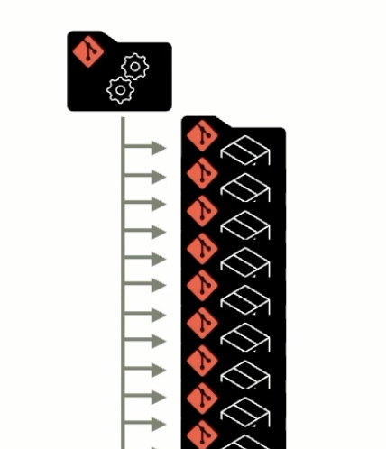

Mono-repo eller mange repo? 
# Prøv meta-repo!
## Workshop

JavaZone 2025

<small>Kjetil Jørgensen-Dahl - Telenor</small>

Note:
- Velkommen til workshop om meta-repositories
- 2 timer sammen
- En ganske praktisk tilnærming
- Hvor mange jobber med 5+ repos?
- Hvem har vurdert monorepo?
- WiFi-passord

--

## 📋 Agenda

- **Introduksjon** - Problemet og løsningen
- **Workshop** - Presentasjon, demo og hands-on
- **Avslutning** - Hva mer kan man gjøre?

Note:
- Mye praktisk arbeid
- Spør underveis!

--

## 🎯 Læringsmål

- Forstå meta-repo og `meta`
- Sette opp og bruke et meta-repo
- Hvordan forenkle arbeid med mange repositories
- Nye muligheter med meta-repo

--

## Hvem er jeg?

- Kjetil 
- 25+ år som utvikler 
- Interessert i _utvikleropplevelsen_
- Mange år som konsulent, så noen år i NAV
- Nå jobber jeg i Telenor

Note:
- Jeg er Kjetil Jørgensen-Dahl
- Utvikleropplevelsen
  - Jeg liker å være "i sonen", i flyt, alene, eller helst sammen med andre
  - Da er det viktig at ting fungerer, at det er enkelt å jobbe
  - Så jeg liker å kunne kjøre ting lokalt på maskinen (fordi man ikke stoppes av avhengigheter til sentrale systemer, nettverk osv)
  - Jeg liker også at vi har en viss orden i ting så vi ikke må bruke dyrebar tankekraft å prøve å huske hvordan man gjør ting i det ene eller det andre repoet
- Jobbet i mange team, og mange forskjellige oppsett
 - Jobbet i team med mange git-repositories


---

# Del 1: Problemet

--

## Mange git-repo er vanlig


Note:
- Jeg spurte en del team hos NAV om hvor mange repo de hadde ansvar for
- Som dere ser, så er det noen som har få, men de fleste har ganske mange
- Jeg tenker jo at når man bikker over 10 repo, så begynner det å bli litt mye å holde styr på
- Og her ser dere at mange har mer enn 20, og opp til over 100 repo

--

## Hvorfor mange repo?

- 🏰 Arkitektur: Microservices, frontends/backends <!-- .element: class="fragment" -->
- 🛠️ Verktøykassen: Dårlig støtte for monorepo <!-- .element: class="fragment" -->
- 🔀 Fleksibilitet: Kan bruke ulike teknologier <!-- .element: class="fragment" -->
- 🏗️ Deploy: Uavhengig deploy <!-- .element: class="fragment" -->
- 🧠 Kognitiv last: Enklere å resonnere om et lite repo <!-- .element: class="fragment" -->
- 👨‍💼 Eierskap: Enklere å unngå delt eierskap <!-- .element: class="fragment" -->

Note:
Vi kunne jo tenkt oss at vi lagde en monolitt f eks

- 🏰 Arkitektur: Monolittene er vanskelige, det blir fort spaghetti og vrient å splitte 
  - Typisk microservices-oppsett
  - Hver service sitt repo
  - Utfordringer med koordinering
- 🛠️ Verktøykassen: Dårlig støtte for monorepo med verktøyene vi har/kan
- 🛠️ Fleksibilitet: Java i backend og React i frontend
- 🏗️ Deploy: Uavhengig deploy betyr raskere feedback
- 🧠 Kognitiv last: Enklere å resonnere om endringer i et lite repo
- 👨‍💼 Eierskap: Mindre risiko for delte repo på tvers av team, letter å flytte også

--

## Fra et repo eller to ...

service-a

frontend-app-1

service-b <!-- .element: class="fragment" data-fragment-index="1" -->

service-c <!-- .element: class="fragment" data-fragment-index="1" -->

ioc <!-- .element: class="fragment" data-fragment-index="2" -->

library-x <!-- .element: class="fragment" data-fragment-index="3" -->

frontend-app-2 <!-- .element: class="fragment" data-fragment-index="4" -->

service-d <!-- .element: class="fragment" data-fragment-index="4" -->

osv...<!-- .element: class="fragment" data-fragment-index="5" -->

Note:
... men det stopper jo gjerne ikke der.
Jeg har vært i team med så mange repo at man må inn å lese README for å huske hva det handlet om.
Og i team der det har vært så mye omskiftinger at man er usikre på hvilke repo man eier. Det skal bare én omorganisering til ...

--

## Mange repo

```text
repos
├── frontend-app-1
├── frontend-app-2
├── service–a
├── service–b
├── service-c
├── library-x
├── library-y
├── library-z
└── ioc
```

Note:
Ofte sitter utviklere med noen, eller mange, repo sjekket ut lokalt på maskinen.
Men kanskje ikke *alle* teamet sine, og kanskje noen repo som ikke tilhører teamet.
(service-d er ikke med, library-z er et annet team sitt)

--

## Hva er utfordringene med å ha mange repo?

- 👷 Duplisering av vedlikehold <!-- .element: class="fragment" -->
- 📦 Bygge og deploy-script-duplisering <!-- .element: class="fragment" -->
- 🚀 Tungt å oppdatere på tvers av repos <!-- .element: class="fragment" -->
- 🔄 Versjonssynkronisering <!-- .element: class="fragment" -->
- 🔍 Fragmentert oversikt <!-- .element: class="fragment" -->
- 🔀 Ulike konvensjoner dukker opp <!-- .element: class="fragment" -->
- 🔧 Forbedringer i ett repo blir ikke delt <!-- .element: class="fragment" -->
- 📝 Ikke noe naturlig sted å ha felles dokumentasjon <!-- .element: class="fragment" -->

Note:
- Kjente problemer?
- Hvem har opplevd dette?
- Og så er det jo ikke slik at det ikke finnes løsninger på mye av dette ...
- ... ofte handler det om å lage enda et repo, for eksempel et med felles deployscript.
- Men det finnes ikke én god løsning på alt dette.
- Kanskje med unntak av mono-repo, men det har ulemper som vi var innom.
- 

--

## To løsninger

<div class="two-column">
<div class="column">

### Mange repo

✅ Uavhengig utvikling

✅ Enkel CI/CD per repo

❌ Koordinering vanskelig

❌ Duplisering

</div><!-- .element: class="fragment" data-fragment-index="1" -->
<div class="column">

### Mono-repo

✅ Alt på ett sted

✅ Atomiske endringer

❌ Kompleks CI/CD

❌ Krever andre verktøy

</div><!-- .element: class="fragment" data-fragment-index="2" -->
</div>

--

## Flere alternativ?

### Monolitt?<!-- .element: class="fragment" data-fragment-index="1" -->

Note:

Ok. Finnes det flere alternativ?

Monolitt er jo en løsning
- Alt i en app
- Har vært prøvd før
- Krever ekstrem disiplin for å unngå spaghetti
- Vanskelig med eierskap når det er for stort for ett team

--

## Hva gjør folk for å håndtere mange repo?

- 🚫Ingenting (veldig vanlig!) <!-- .element: class="fragment" -->
- 📚Skiller ut bibliotek eller rammeverk i egne repo <!-- .element: class="fragment" -->
- 👷‍♀️Bygg/deploy i egne repo <!-- .element: class="fragment" -->
- 💲Kommandolinjen til å gjøre ting på tvers <!-- .element: class="fragment" -->
- ䷝ Team-CLI for å gjøre ting på tvers <!-- .element: class="fragment" -->
- 📐Template-repo <!-- .element: class="fragment" -->
- 🤘Meta-repo!! <!-- .element: class="fragment" -->

Note:
... men merk at det skjer ting rundt mono-repo, og det kommer stadig bedre støtte i verktøy
Men det er helt klart en oppstartskost med å komme igang med mono-repo.
De som er villige til å ta den kostnaden er ofte veldig fornøyde etterpå.
Men uansett om man skal dit så tenker jeg meta-repo kan være et godt mellomsteg.

---

# Del 2: Meta-repository 

--

## Hva er et meta-repository?

<div class="two-column">
<div class="column">

- Et git-**repo** som refererer til andre git-repo
  - Gjerne alle teamet sine repo

- **En-veis kopling** fra meta-repoet til de andre repoene
  - De mange repoene er fortsatt uavhengige

</div>
<div class="column">



</div><!-- .element: class="fragment" data-fragment-index="1" -->
</div>

Note: 
- Ett repo:
  - Evt alle repo som tilhører "et system"
  - Eller en annen gruppe av repo man ønsker å håndtere sammen
- Kontekst-switching dreper produktivitet
- Monorepo er ikke alltid svaret
- Meta-repo = best of both worlds

KLIKK!

- En-veis:
  - Pilene her indikerer at meta-repoet øverst vet om de andre
  - Enkelt-repoene vet ikke om meta-repoet eller hverandre
  - De skal oppleves med alle fordelene det er å ha uavhengige repo 

--

## Basisfunksjonalitet i et meta-repo

- Clone og pull'e alle repo'ene
- Et sted å putte ting som er nyttige på tvers<!-- .element: class="fragment" data-fragment-index="2" -->

Note:

- Basisfunksjonaliteten er å kunne clone og pulle alle repo
- Det i seg selv er verdifullt, en ny utvikler kan komme raskt i gang
- KLIKK!
- Det er også et sted å putte ting som er nyttige på tvers.
- Det at du har en slags kontroll over hvor repoene dine er
- ... åpner også muligheter for å gjøre ting på tvers av repoene
- Brukes (vanligvis) bare på utviklermaskin 

--

## Alternative verktøy

- repo (gerrit.googlesource.com/git-repo/)
- git submodules
- git subtree
- git-subrepo (github.com/ingydotnet/git-subrepo)
- myrepos (myrepos.branchable.com)
- **meta** (github.com/mateodelnorte/meta)

Note:

Det finnes ulike verktøy som kan hjelpe, her er noen av dem:
- repo - som har utsprong fra Google/gerrit
- git har et par innebygde løsninger
- git-subrepo - en annen take på dette
- myrepos - et eldre verktøy
- meta - som er det vi skal bruke i dag

meta er et enkelt verktøy, som er lett å komme i gang med, 
og som gir oss det jeg tenker er viktigst.

Disse andre har i varierende grad mer kompleksitet, og noen 
har sterkere koblinger mellom repoene, 
i verste fall et forhold til versjoner og da eksploderer hodet mitt.

---

# Del 3: `meta`-verktøyet

--

## `meta` by Matt Williams

- https://github.com/mateodelnorte/meta

- Krever at du har node/npm installert
  - Mac: `brew install npm`

- Installere meta på maskinen din
  - `npm install -g meta`

Note:
- Laget av en som heter Matt Williams
- Finnes på github
- Forutsetter at du har node/npm installert
- NPM-pakke, ikke eget system
- .meta er bare JSON
- Plugins for alt mulig

- Dere trenger ikke gjøre dette ennå
- Det kommer oppskrift etterhvert

--
## 🛠️ Workshop-oppgaver 👷

Nå skal vi gjøre den første oppgavene i workshopen

1. https://kjetiljd.github.io/meta-repo-workshop/
2. **Gå til workshop**

--

## 🛠️ Workshop-oppgave 1: Installere meta

**Hands-on tid!**

- [**Installere meta**](../workshop/01-prereqs/) - Installer `meta` CLI

Note:
- Start med å installere meta-verktøyet
- Docker-containere kan laste ned mens vi fortsetter
- Spør hvis dere står fast!

--

## Opprette et meta-prosjekt

```bash
mkdir my-meta-repo
cd my-meta-repo
git init
meta init
meta project import [folder 1] [repo url 1]
meta project import [folder 2] [repo url 2]
git add .
git commit -m"Etabler meta-repo"
```

--

## `meta`-kommandoer

```shell
meta git clone [met-repo git url]
```
Oppdatere om nye repo er lagt til:
```shell
meta git update
```

Kommandoer:
```shell
meta exec "<command>"
meta git
meta npm
```
Note:
En ting man kan gjøre er å clone et eksisterende meta-repo
I stedet for å srkive git clone så skrive man meta git clone,
Og så blir meta-repoet og alle sub-repoene klonet

Når nye repo er lagt til i meta-repoet, så kan
gjøre en meta git update for å få de nye repo inn lokalt

Og så finnes det en del kommandoer, blant annet 
meta exec - som kjører en kommando i alle sub-repo-mappene
meta git - som kjører git-kommandoer i alle sub-repo-mappene

Og det finnes flere slike kommandoer, tilgjengelig via plugins
Men jeg tenker at disse er de viktigste.


--

## Struktur på et meta-repo

Repoet inneholder:
- En `.meta`-fil som definerer alle repoene
- `.gitignore` som ignorerer alle repoene sine foldere
- 

```yaml
meta-repo/
├── .meta               # Definerer alle sub-repo
├── .gitignore          # Utelukker sub-repo-mapper
└── +++                 # Annet som er nyttig
```

Note:
- `.meta`-filen er hjertet i et meta-repo
- Den definerer alle repoene som skal håndteres
- `.gitignore` er viktig så du ikke får med alle repoene i meta-repo
- I tillegg kan du ha andre ting som er nyttige på tvers av repoene

--

## Eksempler på meta-prosjekter

| Prosjekt (github.com)                                                                                               |                                                                                      |                                                                                       |
|---------------------------------------------------------------------------------------------------------------------|-------------------------------------------------------------------------------------------|-------------------------------------------------------------------------------------------------|
| [navikt/pia-hub](https://github.com/navikt/pia-hub)                                                                 | [.meta](https://github.com/navikt/pia-hub/blob/main/.meta)                                | [.gitignore](https://github.com/navikt/pia-hub/blob/main/.gitignore)                            |
| [navikt/tbd-spleiselaget-meta](https://github.com/navikt/tbd-spleiselaget-meta)                                     | [.meta](https://github.com/navikt/tbd-spleiselaget-meta/blob/main/.meta)                  | [.gitignore](https://github.com/navikt/tbd-spleiselaget-meta/blob/main/.gitignore)              |
| [opensearch-project/opensearch-plugins](https://github.com/opensearch-project/opensearch-plugins/tree/main/plugins) | [.meta](https://github.com/opensearch-project/opensearch-plugins/blob/main/plugins/.meta) | [.gitignore](https://github.com/opensearch-project/opensearch-plugins/blob/main/plugins/.gitignore) |
| [navikt/eessi-pensjon](https://github.com/navikt/eessi-pensjon)                                                     | [.meta](https://github.com/navikt/eessi-pensjon/blob/master/.meta)                        | [.gitignore](https://github.com/navikt/eessi-pensjon/blob/master/.gitignore)                    |

--

## 🎯 Demo 1: Real-world meta-repo

**eessi-pensjon** - et ekte meta-repo fra NAV

La meg vise dere hvordan dette ser ut i praksis...

- [navikt/eessi-pensjon](https://github.com/navikt/eessi-pensjon) - [.meta](https://github.com/navikt/eessi-pensjon/blob/master/.meta) - [.gitignore](https://github.com/navikt/eessi-pensjon/blob/master/.gitignore)

Note:
- Vis https://github.com/navikt/eessi-pensjon
- Vis .meta-filen og antall repositories
- Forklar hvordan teamet bruker dette
- Påpek .gitignore struktur
- Dette er et ekte team med 15+ repositories

--

## 🛠️ Workshop-oppgave 2: Oppsett

**Hands-on tid!**

- [**Oppsett og grunnleggende struktur**](../workshop/02-setup/) - Klon demo-repo og test grunnleggende kommandoer

Note:
- Nå skal dere få prøve meta selv
- Klon demo-meta-repo og test grunnleggende meta-kommandoer
- Lær .meta-fil struktur
- Spør hvis dere står fast!

--

## 🎯 Demo 2: Meta kommandoer i praksis

**eessi-pensjon** - se meta i action

Hvordan ser `meta exec` og andre kommandoer ut med et ekte system?

Note:
- Vis meta git status på eessi-pensjon
- Kjør meta exec "pwd" for å vise strukturen
- Demonstrer --exclude funksjonalitet
- Vis meta exec "git branch --show-current"
- Forklar hvordan dette sparer tid i daglig arbeid

--

## 🛠️ Workshop-oppgave 3: Kommandoer

**Hands-on tid!**

- [**Kommandolinje-øvelser**](../workshop/03-commands/) - `meta exec` og filtrering

Note:
- Nå skal vi øve på meta-kommandoer
- meta exec, --exclude funksjonalitet
- Spør hvis dere står fast!

---

# Del 4: Automatisering med make

--

## Verktøy: make og Makefile

- **make** er gammelt, kom i 1976 (Bell Labs, Stuart Feldman)
- Opprinnelig for å bygge C-programmer
- I dag: også for å lage enkle kommando-menyer

**Alternativer:**
- Shell-script
- Python-script  
- npm scripts (package.json)

Note:
make er et klassisk Unix-verktøy fra 1976, laget av Stuart Feldman ved Bell Labs.
Opprinnelig designet for å bygge C-programmer ved å definere avhengigheter mellom filer.
I dag brukes det til å automatisere alle typer oppgaver - ikke bare bygging.

--

## Makefile syntax

```makefile
target: dependencies
	command (må ha tab, ikke spaces!)

build: clean
	gcc -o program main.c
	
clean:
	rm -f *.o program
```

**Viktig:**
- Tab før kommando (ikke spaces)
- Første target blir default

Note:
Syntax: target etterfulgt av kolon, så avhengigheter. 
Under må det være tab (ikke spaces!) før kommandoen.
Første target i filen blir default - kjøres hvis du bare skriver "make".

--

## Hvordan kjøre make

```bash
# Kjør første (default) target
make

# Kjør spesifikt target
make clean
make build

# Kjør flere targets
make clean build
```

**Eksempel:**
```bash
$ make help
help                 : Show available commands
build               : Build Docker image  
serve               : Start Jekyll server
```

Note:
make uten argumenter kjører første target i Makefile.
Du kan spesifisere hvilket target du vil kjøre.
Du kan også kjøre flere targets i sekvens.

--

## .PHONY - hva er det?

```makefile
.PHONY: clean help build

clean:
	rm -f *.o

help:
	@echo "Available commands..."
```

**Hvorfor .PHONY?**
- Forteller make at dette ikke er en fil
- Bare en kommando som skal kjøres
- Unngår konflikter med filer som har samme navn

Note:
.PHONY forteller make at dette ikke er en fil som skal lages, bare en kommando.
Hvis du har en fil som heter "clean" og et target som heter "clean", 
vil make tro at filen er oppdatert og ikke kjøre kommandoen.
Med .PHONY unngår du dette problemet.

--

## Smart .PHONY trick

```makefile
.PHONY: $(shell sed -n -e '/^$$/ { n ; /^[^ .\#][^ ]*:/ { s/:.*$$// ; p ; } ; }' $(MAKEFILE_LIST))
```

**Hva gjør denne?**
- Finner automatisk alle targets i Makefile
- Legger alle i .PHONY
- Du slipper å huske å oppdatere .PHONY manuelt

Note:
Dette er et smart triks som automatisk finner alle targets i Makefile og legger dem i .PHONY.
Da slipper du å huske å oppdatere .PHONY-lista hver gang du legger til et nytt target.
Regex-en ser etter linjer som ser ut som targets (ikke har punktum eller # først).

--

## Help-kommando eksempel

```makefile
help: # Extracts make targets with double-hash comments
	@grep -hE '^\S+:.*##' $(MAKEFILE_LIST) | \
	sed -e 's/:.*##\s*/ : /' | \
	while IFS=' : ' read -r cmd desc; do \
		printf "\033[36m%-20s\033[0m %s\n" "$$cmd" "$$desc"; \
	done

build: ## Build Docker image
	docker build -t myapp .

serve: ## Start development server  
	docker run -p 4000:4000 myapp
```

Note:
Dette er et smart pattern for å lage hjelp-kommando.
Targets med dobbel-hash (##) blir automatisk plukket opp og vist som hjelp.
grep finner alle linjer med ##, sed formaterer dem, og printf printer dem pent med farger.

--

## 🛠️ Workshop-oppgave 4

**Hands-on: Automatisering med Make**

- [**Automatisering med make/scripts**](../workshop/04-automation/) - Makefile oppsett, make stats med cloc

Note:
- Nå skal vi jobbe med make og meta-repo
- Lag Makefile med nyttige kommandoer
- Inkluderer make stats med cloc for kodeanalyse
- Dette bygger videre på det vi lærte i oppgave 1-3

--

## 🎯 Demo 3: Real-world automatisering

**eessi-pensjon** - Makefile og Gradle oppgraderinger

Hvordan ser automatisering ut med et ekte system?

Note:
- Vis Makefile i eessi-pensjon
- Kjør make stats og vis cloc-output
- Demonstrer make hotspots for git-analyse
- Vis gradle wrapper oppgraderinger på tvers
- Forklar hvordan dette brukes i daglig arbeid

--

## 🛠️ Workshop-oppgave 5

**Hands-on: Git-historikk analyse**

- [**Git-historikk analyse**](../workshop/05-git-history/) - Hotspots og git log analyse

Note:
- Lag "hotspots" make target for å finne mest endrede filer
- Analysere commit-historikk på tvers av repositories
- Identifisere hvilke filer som endres oftest
- Nyttig for å forstå hvor kompleksiteten ligger

--

## 🎯 Demo 4: Git historikk analyse

**eessi-pensjon** - hvilke filer endres oftest?

Praktisk git-analyse med 15+ repositories

Note:
- Kjør make hotspots på eessi-pensjon
- Vis hvilke filer som endres oftest
- Demonstrer git log analyse på tvers
- Forklar hvordan dette hjelper med arkitektur-beslutninger
- Vis commit patterns og utviklingsaktivitet


---

# Del 5: Docker & Docker Compose

--

## Hvorfor Docker i meta-repo?

- **Konsistent miljø** på tvers av alle repos
- **Isolering** av dependencies og versjoner  
- **Reproduserbarhet** - samme miljø lokalt og i CI/CD
- **Enkelt onboarding** - ny utvikler kan starte raskt
- **Multi-service koordinering** med Docker Compose

Note:
Docker løser mange av utfordringene med å ha mange repositories:
- Konsistent miljø: Alle får samme versjon av Node, Python, Java etc
- Isolering: Dependencies fra et repo påvirker ikke andre
- Reproduserbarhet: Det som funker på din maskin funker også på andres
- Enkelt onboarding: En kommando starter hele stacken
- Multi-service: Docker Compose kan starte mange services samtidig

--

## Docker Compose for meta-repo

```yaml
services:
  frontend:
    build: ./todo-frontend
    ports:
      - "8081:80"
    depends_on:
      - backend

  backend:
    build: ./todo-backend
    ports:
      - "8082:8080"
    depends_on:
      - sorter

  sorter:
    build: ./todo-sorter
    ports:
      - "8083:3001"
```

Note:
Docker Compose lar deg definere alle services i meta-repoet ditt i én fil.
Hver service kan bygges fra sitt eget repo.
Dependencies mellom services håndteres automatisk.
Port-mapping gjør at du kan nå alle services fra localhost.

--

## Integration med make

```makefile
up: ## Start alle services
	docker-compose up -d
	$(MAKE) urls

down: ## Stopp alle services  
	docker-compose down

logs: ## Vis service logs
	docker-compose logs -f

urls: ## Vis service URLs
	@echo "Frontend: http://localhost:8081"
	@echo "Backend:  http://localhost:8082/api/todos/count" 
	@echo "Sorter:   http://localhost:8083/health"
```

Note:
Ved å kombinere Docker Compose med make får du kraftige shortcuts.
-d flag starter services i bakgrunnen
logs lar deg følge med på all output fra alle services
urls-kommandoen viser hvor du finner alle services

--

## Fordeler med Docker-oppsett

✅ **En kommando** starter hele systemet

✅ **Automatisk dependency-håndtering**

✅ **Konsistente versjoner**

✅ **Enkelt å legge til nye services**

✅ **CI/CD blir enklere**

Note:
Hovedfordelene:
- En kommando: `make up` og alt er i gang
- Automatisk: Docker Compose kan starte services i riktig rekkefølge
- Konsistente versjoner: Dockerfile kan om man vil definere eksakte versjoner
- Skalerbart: Nye services legges bare til i docker-compose.yml
- Samme docker kan brukes i CI/CD pipelines og i produksjon

--

## 🛠️ Workshop-oppgave 6

**Hands-on: Docker og Docker Compose**

- [**Docker og Docker Compose**](../workshop/06-dockered/) - Multi-service koordinering

Note:
- Sett opp Docker Compose for meta-repo
- Koordiner oppstart av flere services
- Integrer Docker kommandoer med Makefile
- Få oversikt over alle service-URLs

--

## 🎯 Demo 6: Analyse på tvers av repositories

**eessi-pensjon** - Spring Boot versjoner og cloc kodestatistikk

Hvordan få oversikt over hele økosystemet?

Note:
- Vis hvordan finne Spring Boot versjoner på tvers av alle repos
- Kjør cloc analyse på hele meta-repoet
- Demonstrer tertial-rapport og kodestatistikk
- Forklar hvordan dette hjelper med teknisk gjeld og oppgraderinger

---

# Del 6: IDE-integrasjon

--

## Utfordringen med IDE og mange repos

- **Separate prosjekter** i IDE for hvert repo
- **Ingen oversikt** over hele systemet
- **Komplisert navigering** mellom repositories
- **Inkonsistent kodestil** på tvers av repos
- **Vanskelig refactoring** på tvers

Note:
Når du har mange repositories blir det vanskelig å jobbe effektivt i IDEer som IntelliJ:
- Hver repo må åpnes som eget prosjekt
- Du mister helhetsbildet av systemet
- Navigering mellom repos blir tregt og omstendelig
- Refactoring som berører flere repos blir nærmest umulig
- Kodestil og konfigurasjoner kan drifta fra hverandre

--

## Gradle Composite Build

```gradle
// settings.gradle
rootProject.name = "todo-meta"

includeBuild "todo-frontend"
includeBuild "todo-backend"  
includeBuild "todo-sorter"
```
Note:
Gradle Composite Build lar deg kombinere flere separate Gradle-prosjekter til ett stort prosjekt.

--

## Kan åpnes som ett prosjekt i IntelliJ

Alle sub-prosjekter i **én IntelliJ-workspace**
- **Cross-repository refactoring**
- **Søk** på tvers av repos
- **Konsistent konfiguration**

Note:
Nå kan vi åpne det hele som ett prosjekt i IntelliJ.
IntelliJ forstår strukturen og behandler det som ett stort prosjekt.
Men ikke alt virker så dette er mest for reading.

--

## IntelliJ fordeler

✅ **Global search** på tvers av alle repos

✅ **Refactoring** som berører flere prosjekter

✅ **Cross-project navigation**

✅ **Shared build configurations**

Note:
Med Gradle Composite Build får du:
- Global search: Finn all bruk av en klasse på tvers av repos
- Refactoring: Endre et interface og få oppdatert alle implementasjoner
- Run configurations: Start hele systemet fra IDE-et
- Navigation: Hopp mellom klasser selv om de er i forskjellige repos
- Code style: Konsistente formateringsregler overalt
- Build configs: Felles konfigurasjon for alle prosjekter

--

## 🎯 Demo 7: IDE integrasjon med unified workspace

**eessi-pensjon** - enhetlig søk, navigering og workspace

Gradle Composite Build i praksis

Note:
- Vis enhetlig IntelliJ workspace med alle repositories
- Demonstrer global search på tvers av alle repos
- Vis cross-repository navigation og refactoring
- Forklar hvordan dette forbedrer utvikleropplevelsen betydelig
- Sammenlign med å ha 15+ separate prosjekter åpne

--
## 🛠️ Workshop-oppgave 7

**Hands-on: IDE-integrasjon**

- [**IDE-integrasjon**](../workshop/07-ide-integration/) - Gradle Composite Build

Note:
- Sett opp Gradle Composite Build for meta-repo
- Åpne alle repositories som ett prosjekt i IntelliJ
- Utforsk unified workspace og cross-repo navigation
- Opplev global search på tvers av alle repos

---

# Del 7: Templates på tvers av repositories

--

## Utfordringen med konsistens

**Når du har mange repos:**
- Forskjellige CI/CD-konfigurasjoner
- Ulike Docker-oppsett  
- Inkonsistente kodestandarder
- Manuelle oppdateringer tar tid

**Løsning: Template-system**

Note:
Med mange repositories blir det utfordrende å holde konfigurasjoner konsistente.
Hver repo kan drifte i sin egen retning.
Template-systemer løser dette ved å sentralisere og automatisere oppdateringer.

--

## Template-system med Jinja2

**Arkitektur:**
```
templates/
├── .github/workflows/ci.yml      # Template for CI
├── Dockerfile.j2                 # Docker template
└── .gitignore                    # Standard gitignore

template-data/
├── service-a.yml                 # Data for service-a
├── service-b.yml                 # Data for service-b
└── frontend.yml                  # Data for frontend
```

**Generering:**
```bash
make generate-files  # Oppdater alle repos med templates
```

Note:
Template-systemet bruker Jinja2 for å generere filer.
Templates definerer strukturen, data-filer tilpasser per repository.
Ett make-kommando oppdaterer alle repositories.

--

## Eksempel: GitHub Actions template

**Template** (.github/workflows/ci.yml):
```yaml
name: CI/CD Pipeline
on: [push, pull_request]
jobs:
  build:
    runs-on: ubuntu-latest  
    steps:
    - uses: actions/setup-java@v3
      with:
        java-version: {{ java_version }}
    - run: ./gradlew build
```

**Data-fil** (template-data/service-a.yml):
```yaml
java_version: "21.0.4"
app_name: "service-a"
```

Note:
Templates bruker Jinja2-syntaks med {{ variable }}.
Hver repository har sin egen data-fil med spesifikke verdier.
Dette gir fleksibilitet mens konsistensen bevares.

--

## 🎯 Demo 6: Template-system

**Java version oppgradering fra 21.0.4 til 21.0.8**

Live demo: Koordinert oppgradering på tvers av alle repos

Note:
- Vis template-systemet i eessi-pensjon
- Demonstrer Java version bump fra 21.0.4 til 21.0.8
- Kjør make generate-files for å oppdatere alle repos
- Forklar hvordan dette brukes for Docker base images, dependencies osv.

--

## Template-muligheter I

**Konfigurasjonsfiler:**
- GitHub Actions workflows
- Docker og docker-compose filer
- Makefile standarder
- .gitignore og .editorconfig

--

## Template-muligheter II

**Kode-templates:**
- README-struktur
- Kubernetes manifests  
- Security-konfigurasjoner
- Monitoring og alerting

--

## Template-muligheter III

**Automatisering:**
- Scheduled template updates
- Dependency version bumps
- Security bump rollouts

Note:
Template-systemer kan standardisere alt fra build-konfigurasjoner til dokumentasjon.
Automatisering gjør at oppdateringer kan kjøres på schedule.
Perfekt for security patches og dependency management.

---

# Del 8: Cross-repo koordinering: Mer enn bare kode

--

## 🛠️ Hands-on: Cross-repo

La oss prøve noe selv:

➡️ [**Cross-repo endring**](../workshop/08-cross-repo/)

Endringer på tvers av repositories – med git.

--

## Flere cross-repo muligheter

**Build & CI/CD:**
- Oppdatere gradle-wrapper og andre verktøy (Docker, Node, Python)
- Bytte Docker baseimage

--

## Flere cross-repo muligheter

**Kode-modernisering:**
- Oppdatere mange steder pga deprekert API
- Trekke ut bibliotek fra flere app'er
- Konsolidere/redusere variasjon (Kent Beck: "Normalize Symmetries")

--

## Flere cross-repo muligheter

**Infrastruktur:**
- Endringer i oppstartsscript for Docker-containere
- Oppsett av regler og sjekker for brancher/PR'er på GitHub
- Sette opp formatteringsregler (.editorconfig)
- Minor/patch/major-oppgraderinger av avhengigheter

Note:
Dette er bare noen eksempler på hva som er mulig med meta-repo koordinering.
Meta-mønsteret åpner for mange kreative løsninger på repetitive oppgaver.

--

# Spørsmål?

---

Mono-repo eller mange repo?
# Prøv meta-repo!
## Workshop

**Takk for deltakelsen!** 🙏

JavaZone 2025

<small>Kjetil Jørgensen-Dahl - Telenor</small>

